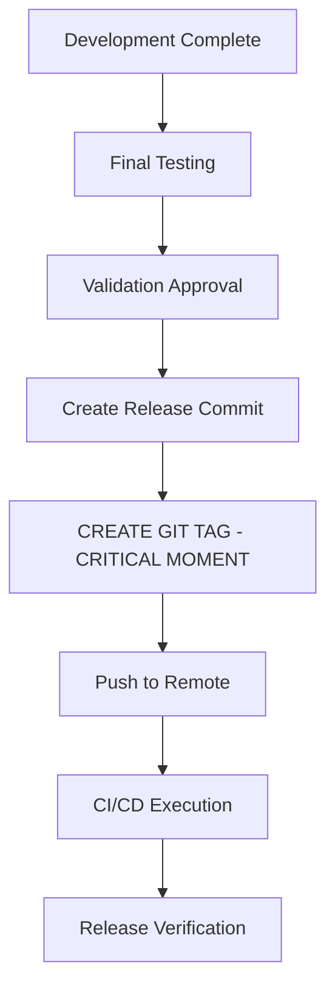
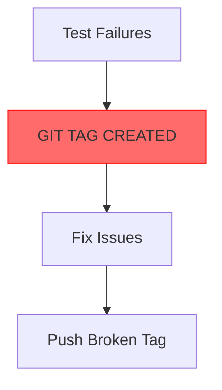

# Release Process Specification

## Overview

This document defines the complete release process for uiautomator2-mcp-server, including all phases, checks, and procedures.

## ⚠️ CRITICAL: Git Tag Timing Protocol

### The Golden Rule of Release Tagging

**GIT TAG CREATION MUST HAPPEN AT THE ABSOLUTE LAST POSSIBLE MOMENT BEFORE PUSHING TO REMOTE**

This is the single most important rule in the entire release process.

### Why Proper Tag Timing Matters

Improper tag timing leads to:
- **Broken releases**: Tags pointing to untested/incomplete code
- **Version confusion**: Multiple tags for the same logical release
- **Rollback complexity**: Difficult to determine correct rollback point
- **User trust issues**: Published versions that don't match expectations

### The Correct Release Sequence

#### ✅ **MANDATORY ORDER OF OPERATIONS:**



#### ❌ **PROHIBITED PATTERNS:**



## Release Workflow Phases

### 1. Codebase Evaluation Phase

#### Objectives:
- Assess repository health and readiness
- Validate current state against release criteria
- Identify potential blockers or issues

#### Required Checks:
- ✅ Git repository status (clean working directory)
- ✅ Current branch validation (should be develop)
- ✅ Remote synchronization status
- ✅ Recent commit history analysis
- ✅ Version number consistency across files
- ✅ CHANGELOG completeness and accuracy
- ✅ Outstanding issues and pull requests

#### ⚠️ **ABSOLUTE PROHIBITION:**
- **NO git tagging allowed in this phase**
- **NO pushing to remote**
- **NO release commit creation**

#### Success Criteria:
- No uncommitted changes (unless in aggressive mode)
- On correct branch (develop for standard releases)
- Repository synchronized with remote
- Valid version numbering scheme
- Complete and accurate CHANGELOG entries

### 2. Quality Assurance Phase

#### Objectives:
- Ensure code quality meets release standards
- Validate functionality through comprehensive testing
- Confirm documentation accuracy and completeness

#### Required Checks:
- ✅ Full test suite execution (unit + integration)
- ✅ Pre-commit hook validation (linting, formatting)
- ✅ Documentation validation (README, CHANGELOG, etc.)
- ✅ Dependency verification and security scanning
- ✅ Breaking change detection and migration validation

#### ⚠️ **ABSOLUTE PROHIBITION:**
- **NO git operations of ANY kind**
- **NO tag creation**
- **NO remote pushes**
- **NO merge operations**

#### Success Criteria:
- All tests pass consistently (100% success rate)
- Pre-commit checks complete without errors
- Documentation is complete, accurate, and properly formatted
- Dependencies are up-to-date and secure
- Breaking changes have proper migration documentation

### 3. Preparation Phase

#### Objectives:
- Finalize all release artifacts
- Update version information consistently
- Prepare release communications

#### Required Tasks:
- ✅ Version number finalization and consistency check
- ✅ CHANGELOG entry completion and review
- ✅ README and documentation updates
- ✅ Release notes preparation
- ✅ Announcement draft creation

#### ⚠️ **CRITICAL CONSTRAINTS:**
- **Changes can be made but NOT committed/tagged yet**
- **NO git tag creation in this phase**
- **NO pushing to remote repositories**
- **Local changes only**

#### Success Criteria:
- Version numbers consistent across all files
- CHANGELOG entry complete with proper formatting
- Documentation updated for new features/changes
- Release notes drafted with key highlights
- All preparation tasks completed successfully

### 4. Execution Phase (THE CRITICAL PHASE)

#### Objectives:
- Execute the actual release operations in CORRECT sequence
- Create proper version control history
- Publish release artifacts with proper timing

#### ⚠️ **MANDATORY SEQUENCE - NO DEVIATIONS ALLOWED:**

1. **CREATE FINAL RELEASE COMMIT**
   ```bash
   git add .
   git commit -m "Release v0.2.0"
   ```

2. **MERGE TO MAIN BRANCH** (if using GitFlow)
   ```bash
   git checkout main
   git merge develop
   ```

3. **CREATE GIT TAG - THE CRITICAL MOMENT** ⚡
   ```bash
   git tag -a v0.2.0 -m "Release v0.2.0"
   ```
   **THIS IS WHERE 90% OF RELEASE ERRORS OCCUR**

4. **PUSH CHANGES AND TAG TO GITHUB**
   ```bash
   git push origin main
   git push origin v0.2.0
   ```

5. **TRIGGER CI/CD PIPELINE EXECUTION**

#### Success Criteria:
- Release commit created with proper message format
- Clean merge from develop to main (no conflicts)
- **GIT TAG CREATED AT EXACTLY THE RIGHT MOMENT**
- Changes successfully pushed to remote repository
- CI/CD pipeline triggered without errors

### 5. Verification Phase

#### Objectives:
- Confirm successful release publication
- Validate artifact availability
- Monitor deployment processes

#### Required Verifications:
- ✅ GitHub release creation confirmation
- ✅ PyPI package availability verification
- ✅ CI/CD pipeline completion monitoring
- ✅ Documentation site deployment verification
- ✅ Notification sending confirmation

#### Success Criteria:
- GitHub release published with correct assets
- PyPI package available and installable
- CI/CD pipelines completed successfully
- Documentation site updated and accessible
- Release notifications sent to appropriate channels

## Release Types and Variations

### Standard Release
- Full workflow execution with proper tag timing
- All phases and checks required
- Normal safety level defaults
- Complete documentation updates

### Hotfix Release
- Accelerated workflow for critical fixes
- **STILL FOLLOWS EXACT SAME TAG TIMING**
- Minimal feature changes allowed
- Expedited review process
- Focused testing on affected areas

### Pre-release (Alpha/Beta/RC)
- Limited distribution scope
- Experimental feature inclusion
- Special version numbering (alpha/beta/rc suffixes)
- **TAG TIMING STILL CRITICAL**
- Reduced stability guarantees

### Dry Run Release
- Complete simulation without actual publishing
- All checks and preparations executed
- **NO ACTUAL TAG CREATION**
- No permanent changes to repository
- Useful for process validation and training

## Safety Levels

### Conservative Mode
- Maximum human oversight required
- Manual approval at every checkpoint
- **EXTRA EMPHASIS ON TAG TIMING APPROVAL**
- Strict adherence to all checks
- Zero tolerance for warnings or minor issues

### Balanced Mode (Default)
- Reasonable automation with key checkpoints
- Automated execution with strategic pause points
- **MANUAL APPROVAL REQUIRED FOR GIT TAG CREATION**
- Standard safety margins and validation
- Recommended for routine releases

### Aggressive Mode
- Maximum automation with minimal human intervention
- Fast-tracked processes for experienced teams
- **EVEN IN AGGRESSIVE MODE: GIT TAG TIMING IS SACROSANCT**
- Relaxed requirements for non-critical checks
- Use with caution and proper risk assessment

## Error Handling and Recovery

### Critical Tag Timing Violations:

1. **Premature Tag Creation Detected**
   - Immediate workflow halt
   - Tag deletion procedure
   - Process restart from beginning
   - Enhanced monitoring for remainder of release

2. **Tag Created on Wrong Commit**
   - Tag deletion and recreation
   - Commit history verification
   - Manual intervention required
   - Post-mortem documentation mandatory

3. **Multiple Tags for Same Release**
   - Tag cleanup procedures
   - Version consistency restoration
   - Communication to users/community
   - Process improvement implementation

### Common Failure Scenarios:

1. **Test Failures During QA**
   - Immediate workflow pause
   - Detailed failure analysis and reporting
   - Option to fix issues and restart phase
   - Emergency rollback procedures available

2. **Git Conflicts During Merge**
   - Automatic conflict detection
   - Branch backup before merge attempts
   - Manual resolution workflow initiation
   - Safe rollback to pre-merge state

3. **Version Numbering Issues**
   - Consistency validation across all files
   - Automatic correction suggestions
   - Manual review requirement for discrepancies
   - Prevention of inconsistent version states

4. **CI/CD Pipeline Failures**
   - Real-time monitoring and alerting
   - Failure categorization and impact assessment
   - Retry mechanisms for transient failures
   - Emergency rollback for persistent issues

### Rollback Procedures:

1. **Soft Rollback**: Revert specific changes while preserving work
2. **Hard Rollback**: Complete state restoration to pre-release condition
3. **Selective Rollback**: Targeted reversal of specific operations
4. **Emergency Rollback**: Immediate stop and full restoration procedures

## Success Metrics and Monitoring

### Key Performance Indicators:
- Time from start to successful release
- Number of automated vs manual interventions
- Test pass rates and quality scores
- Documentation completeness metrics
- **CRITICAL**: Proper tag timing compliance (100% required)
- User feedback and adoption rates

### Monitoring Requirements:
- Real-time progress tracking
- Automated status reporting
- Alert systems for critical failures
- **SPECIFIC MONITORING**: Tag creation timing verification
- Performance analytics and trending
- Post-release health monitoring

## Post-Release Activities

### Immediate Follow-up:
- Release announcement distribution
- User notification and communication
- Support channel preparation
- Initial user feedback collection

### Ongoing Monitoring:
- Usage analytics and adoption tracking
- Bug report monitoring and triage
- Performance metric analysis
- Community feedback aggregation

### Process Improvement:
- Release retrospective and lessons learned
- **SPECIFIC REVIEW**: Tag timing protocol adherence
- Workflow optimization identification
- Tool and automation enhancement
- Documentation and training updates

This specification ensures consistent, reliable, and high-quality releases while maintaining flexibility for different scenarios and organizational needs. The git tag timing protocol is absolutely critical and must never be violated.
