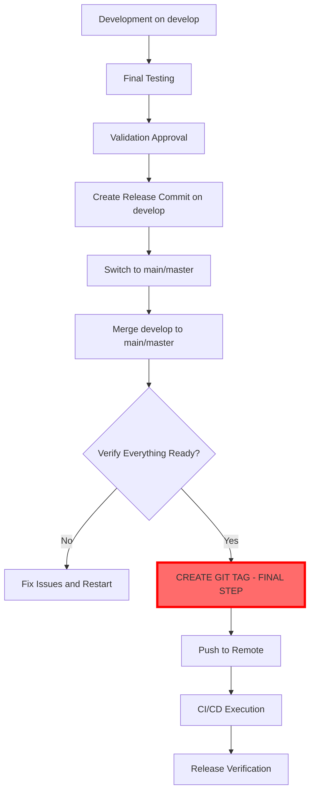
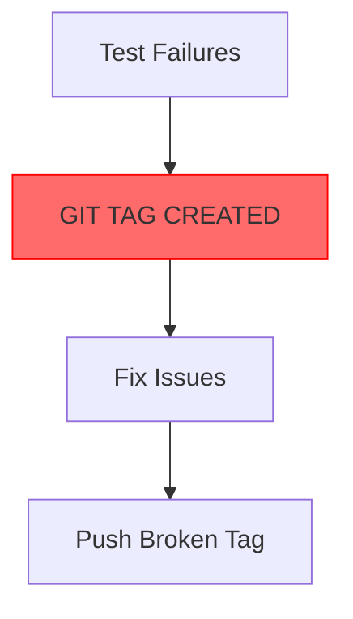

# Release Process Specification

## Overview

This document defines the complete release process for uiautomator2-mcp-server, including all phases, checks, and procedures.

## ⚠️ CRITICAL: Git Tag Timing & Branch Management Protocol

### The Golden Rules of Release Tagging

**RULE 1**: GIT TAG CREATION IS THE ABSOLUTE FINAL STEP - NOTHING COMES AFTER TAGGING EXCEPT PUSH

**RULE 2**: GIT TAGS MUST BE CREATED ON THE MAIN/MASTER BRANCH ONLY, NEVER ON DEVELOP

**RULE 3**: ALL WORK MUST BE COMPLETE AND MERGED TO MAIN/MASTER BEFORE ANY TAG IS CREATED

These three rules are non-negotiable and form the foundation of reliable release management.

### Release Branch Strategy

- **Development Branch**: `develop` - All feature development happens here
- **Release Branch**: `main` or `master` - Release tags are created here only
- **Merge Direction**: `develop` → `main`/`master` (never the reverse)

### Why Proper Tag Timing & Branch Management Matters

Improper tag timing leads to:
- **Broken releases**: Tags pointing to untested/incomplete code
- **Version confusion**: Multiple tags for the same logical release
- **Rollback complexity**: Difficult to determine correct rollback point
- **User trust issues**: Published versions that don't match expectations

Improper branch management leads to:
- **Deployment errors**: CI/CD triggered on wrong branch
- **Version detection issues**: Tools looking for tags on main don't find them
- **History confusion**: Release history scattered across branches

The "tag as final step" rule ensures:
- The tagged commit is EXACTLY what gets published
- No last-minute changes can sneak in after tagging
- The release commit hash matches the tag commit hash
- Rollback point is unambiguous

### The Correct Release Sequence

#### ✅ **MANDATORY ORDER OF OPERATIONS:**



#### ❌ **PROHIBITED PATTERNS:**



## Release Workflow Phases

### 1. Codebase Evaluation Phase

#### Objectives:
- Assess repository health and readiness
- Validate current state against release criteria
- Identify potential blockers or issues

#### Required Checks:
- ✅ Git repository status (clean working directory)
- ✅ **ALL files committed** - check for untracked files that should be included
- ✅ Current branch validation (should be develop)
- ✅ Remote synchronization status
- ✅ Recent commit history analysis
- ✅ Version number consistency across files
- ✅ CHANGELOG completeness and accuracy
- ✅ Outstanding issues and pull requests

#### ⚠️ **ABSOLUTE PROHIBITION:**
- **NO git tagging allowed in this phase**
- **NO pushing to remote**
- **NO release commit creation**

#### Success Criteria:
- No uncommitted changes (unless in aggressive mode)
- On correct branch (develop for standard releases)
- Repository synchronized with remote
- Valid version numbering scheme
- Complete and accurate CHANGELOG entries

### 2. Quality Assurance Phase

#### Objectives:
- Ensure code quality meets release standards
- Validate functionality through comprehensive testing
- Confirm documentation accuracy and completeness

#### Required Checks:
- ✅ Full test suite execution (unit + integration)
- ✅ Pre-commit hook validation (linting, formatting)
- ✅ Documentation validation (README, CHANGELOG, etc.)
- ✅ Dependency verification and security scanning
- ✅ Breaking change detection and migration validation

#### ⚠️ **ABSOLUTE PROHIBITION:**
- **NO git operations of ANY kind**
- **NO tag creation**
- **NO remote pushes**
- **NO merge operations**

#### Success Criteria:
- All tests pass consistently (100% success rate)
- Pre-commit checks complete without errors
- Documentation is complete, accurate, and properly formatted
- Dependencies are up-to-date and secure
- Breaking changes have proper migration documentation

### 3. Preparation Phase

#### Objectives:
- Finalize all release artifacts
- Update version information consistently
- Prepare release communications

#### Required Tasks:
- ✅ Version number finalization and consistency check
- ✅ CHANGELOG entry completion and review
- ✅ README and documentation updates
- ✅ Release notes preparation
- ✅ Announcement draft creation

#### ⚠️ **CRITICAL CONSTRAINTS:**
- **Changes can be made but NOT committed/tagged yet**
- **NO git tag creation in this phase**
- **NO pushing to remote repositories**
- **Local changes only**

#### Success Criteria:
- Version numbers consistent across all files
- CHANGELOG entry complete with proper formatting
- Documentation updated for new features/changes
- Release notes drafted with key highlights
- All preparation tasks completed successfully

### 4. Execution Phase (THE CRITICAL PHASE)

#### Objectives:
- Execute the actual release operations in CORRECT sequence
- Create proper version control history
- Publish release artifacts with proper timing

#### ⚠️ **MANDATORY SEQUENCE - NO DEVIATIONS ALLOWED:**

**BRANCH CONTEXT:**
- Development branch: `develop`
- Release branch: `main` or `master`

0. **PRE-MERGE VERIFICATION** (on develop)
   ```bash
   git status  # MUST show clean working directory
   git branch  # Verify on develop
   ```

1. **CREATE FINAL RELEASE COMMIT** (on develop)
   ```bash
   git add .
   git commit -m "Release v0.2.0"
   ```

2. **SWITCH TO RELEASE BRANCH**
   ```bash
   git checkout main  # or 'master'
   ```

3. **MERGE DEVELOP TO RELEASE BRANCH**
   ```bash
   git merge develop
   # Verify this is a fast-forward merge or clean merge
   ```

4. **POST-MERGE VERIFICATION** (CRITICAL)
   ```bash
   git status  # MUST show clean working directory
   git branch  # MUST show * main (or * master)
   git log -1  # Verify correct commit
   ```

5. **FINAL PRE-TAG CHECK** (THE LAST CHANCE TO CATCH ISSUES)
   ```bash
   # Are ALL changes committed? YES
   # Are we on main/master branch? YES
   # Has the merge been completed? YES
   # Have tests passed? YES
   # Is CHANGELOG updated? YES
   # If ALL YES → Proceed to tagging
   # If ANY NO → STOP and fix
   ```

6. **CREATE GIT TAG - THE FINAL STEP** ⚡
   ```bash
   git tag -a v0.2.0 -m "Release v0.2.0"
   ```
   **THIS IS THE FINAL STEP - NOTHING COMES AFTER TAGGING EXCEPT PUSH**
   - **MUST be on main (or master) branch**
   - **MUST have all changes committed**
   - **MUST be after merge is complete**
   - **This is the point of no return**

7. **PUSH TO REMOTE** (immediately after tagging)
   ```bash
   git push origin main  # or 'master'
   git push origin v0.2.0
   ```

8. **TRIGGER CI/CD PIPELINE EXECUTION**

   After push, CI automatically:
   - Runs all tests (lint, type-check, pytest)
   - Builds distribution packages (wheel + sdist)
   - Publishes to PyPI (via Trusted Publishing)
   - Creates GitHub Release with CHANGELOG notes
   - Attaches wheel files to the Release

#### Success Criteria:
- Release commit created with proper message format
- Clean merge from develop to main (no conflicts)
- **GIT TAG CREATED AT EXACTLY THE RIGHT MOMENT**
- Changes successfully pushed to remote repository
- CI/CD pipeline triggered without errors
- PyPI package published successfully
- GitHub Release created with correct assets

### 5. Verification Phase

#### Objectives:
- Confirm successful release publication
- Validate artifact availability
- Monitor deployment processes

#### Required Verifications:
- ✅ GitHub release creation confirmation (automatic via CI)
- ✅ PyPI package availability verification (automatic via CI)
- ✅ CI/CD pipeline completion monitoring
- ✅ Release notes content verification (from CHANGELOG)
- ✅ Wheel files attached to release

#### Success Criteria:
- GitHub release published automatically with correct assets
- PyPI package available and installable
- CI/CD pipelines completed successfully
- Release notes populated from CHANGELOG entry
- Wheel and source distribution files attached

## Release Types and Variations

### Standard Release
- Full workflow execution with proper tag timing
- All phases and checks required
- Normal safety level defaults
- Complete documentation updates

### Hotfix Release
- Accelerated workflow for critical fixes
- **STILL FOLLOWS EXACT SAME TAG TIMING**
- Minimal feature changes allowed
- Expedited review process
- Focused testing on affected areas

### Pre-release (Alpha/Beta/RC)
- Limited distribution scope
- Experimental feature inclusion
- Special version numbering (alpha/beta/rc suffixes)
- **TAG TIMING STILL CRITICAL**
- Reduced stability guarantees

### Dry Run Release
- Complete simulation without actual publishing
- All checks and preparations executed
- **NO ACTUAL TAG CREATION**
- No permanent changes to repository
- Useful for process validation and training

## Safety Levels

### Conservative Mode
- Maximum human oversight required
- Manual approval at every checkpoint
- **EXTRA EMPHASIS ON TAG TIMING APPROVAL**
- Strict adherence to all checks
- Zero tolerance for warnings or minor issues

### Balanced Mode (Default)
- Reasonable automation with key checkpoints
- Automated execution with strategic pause points
- **MANUAL APPROVAL REQUIRED FOR GIT TAG CREATION**
- Standard safety margins and validation
- Recommended for routine releases

### Aggressive Mode
- Maximum automation with minimal human intervention
- Fast-tracked processes for experienced teams
- **EVEN IN AGGRESSIVE MODE: GIT TAG TIMING IS SACROSANCT**
- Relaxed requirements for non-critical checks
- Use with caution and proper risk assessment

## Error Handling and Recovery

### Critical Tag Timing & Branch Violations:

1. **Premature Tag Creation Detected**
   - Immediate workflow halt
   - Tag deletion procedure: `git tag -d v0.2.0`
   - Process restart from beginning
   - Enhanced monitoring for remainder of release

2. **Tag Created on Wrong Branch**
   - **STOP immediately** - do NOT push the tag
   - Tag deletion procedure: `git tag -d v0.2.0`
   - Switch to correct branch (main or master)
   - Merge develop to main/master if not already done
   - Recreate tag on correct commit
   - Post-mortem documentation mandatory

3. **Tag Created Before Merge**
   - **STOP** - do not push
   - Delete the premature tag
   - Complete the merge: develop → main/master
   - Recreate tag after merge is complete
   - Document why this happened

4. **Tag Created Before All Changes Committed**
   - **STOP** - do not push
   - Delete the premature tag
   - Commit remaining changes on develop
   - Merge develop to main/master again
   - Create new tag pointing to correct commit
   - Document what went wrong

4. **Multiple Tags for Same Release**
   - Tag cleanup procedures
   - Version consistency restoration
   - Communication to users/community
   - Process improvement implementation

### Common Failure Scenarios:

1. **Test Failures During QA**
   - Immediate workflow pause
   - Detailed failure analysis and reporting
   - Option to fix issues and restart phase
   - Emergency rollback procedures available
   - **DO NOT proceed to tagging until tests pass**

2. **Git Conflicts During Merge**
   - Automatic conflict detection
   - Branch backup before merge attempts
   - Manual resolution workflow initiation
   - Safe rollback to pre-merge state
   - **DO NOT tag until merge is clean and verified**

3. **Discovered Uncommitted Changes After Merge**
   - **CRITICAL**: Tag cannot be created yet
   - Do NOT create tag until working directory is clean
   - Commit missing changes on develop
   - Merge develop to main/master again
   - Only then proceed to tagging

4. **Tag Created Then Remembered Something Else**
   - This indicates the tag was created too early
   - Delete the tag
   - Complete the forgotten work
   - Redo merge if necessary
   - Create tag only when truly ready

4. **Version Numbering Issues**
   - Consistency validation across all files
   - Automatic correction suggestions
   - Manual review requirement for discrepancies
   - Prevention of inconsistent version states

5. **CI/CD Pipeline Failures**
   - Real-time monitoring and alerting
   - Failure categorization and impact assessment
   - Retry mechanisms for transient failures
   - Emergency rollback for persistent issues

6. **Tag on Wrong Branch**
   - Delete local and remote tag
   - Verify correct branch (main)
   - Ensure merge is complete
   - Recreate tag on correct commit
   - Push corrected tag

### Rollback Procedures:

1. **Soft Rollback**: Revert specific changes while preserving work
2. **Hard Rollback**: Complete state restoration to pre-release condition
3. **Selective Rollback**: Targeted reversal of specific operations
4. **Emergency Rollback**: Immediate stop and full restoration procedures

## Success Metrics and Monitoring

### Key Performance Indicators:
- Time from start to successful release
- Number of automated vs manual interventions
- Test pass rates and quality scores
- Documentation completeness metrics
- **CRITICAL**: Proper tag timing compliance (100% required)
- **CRITICAL**: Correct branch usage (100% required)
- **CRITICAL**: All changes committed before tagging (100% required)
- User feedback and adoption rates

### Monitoring Requirements:
- Real-time progress tracking
- Automated status reporting
- Alert systems for critical failures
- **SPECIFIC MONITORING**: Tag creation timing verification
- **SPECIFIC MONITORING**: Branch verification before tagging
- **SPECIFIC MONITORING**: Working directory cleanliness check
- Performance analytics and trending
- Post-release health monitoring

## Post-Release Activities

### Immediate Follow-up:
- Release announcement distribution
- User notification and communication
- Support channel preparation
- Initial user feedback collection

### Ongoing Monitoring:
- Usage analytics and adoption tracking
- Bug report monitoring and triage
- Performance metric analysis
- Community feedback aggregation

### Process Improvement:
- Release retrospective and lessons learned
- **SPECIFIC REVIEW**: Tag timing protocol adherence
- **SPECIFIC REVIEW**: Branch management process compliance
- **SPECIFIC REVIEW**: Change completeness verification
- Workflow optimization identification
- Tool and automation enhancement
- Documentation and training updates

### Lessons Learned Template:

For each release, document:
1. **What went wrong**: Tag timing issues, branch confusion, uncommitted changes, premature tagging
2. **Root cause analysis**: Why did the error occur? What step was missed or rushed?
3. **Prevention measures**: What checks/procedures need to be added to prevent recurrence?
4. **Process updates**: Update SKILL.md and release-process.md accordingly

### v0.2.0 Release Lessons Learned:

**What went wrong:**
1. Tag was created on develop branch instead of main
2. Tag was created before all changes were committed (release-manager skill files)
3. Tests were not run before tagging attempt

**Root cause analysis:**
1. Branch management workflow was not clearly established
2. Working directory cleanliness was not verified before tagging
3. Testing step was missing from the release checklist

**Prevention measures:**
1. Explicitly define: develop → main/master merge, then tag on main/master
2. Add pre-tag verification checklist that must ALL pass
3. Require test execution before any tagging can proceed
4. Emphasize that tagging is the FINAL step before push

**Process updates:**
- Updated SKILL.md with explicit branch management rules
- Updated release-process.md with mandatory verification steps
- Added "FINAL STEP" emphasis to tag creation
- Added pre-tag checklist that all must pass

This specification ensures consistent, reliable, and high-quality releases while maintaining flexibility for different scenarios and organizational needs. The git tag timing protocol is absolutely critical and must never be violated.
