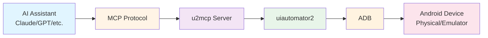

# uiautomator2-mcp-server

[](https://pypi.org/project/uiautomator2-mcp-server/)

[](https://github.com/tanbro/uiautomator2-mcp-server/actions/workflows/ci.yml)
[](https://codecov.io/gh/tanbro/uiautomator2-mcp-server)

[](README.md)
[](README.zh-CN.md)

**Code of Conduct:** Please follow our [Code of Conduct](CODE_OF_CONDUCT.md) when participating in this project.

> **Note:** If you need Mainland China-specific download acceleration (pip/uv mirrors), see the Chinese README for details: [README.zh-CN.md](README.zh-CN.md).

An [MCP](https://modelcontextprotocol.io/) server that provides tools for controlling Android devices using [uiautomator2](https://github.com/openatx/uiautomator2).

> Use AI to automate your Android device: take screenshots, tap/swipe, manage apps, send text, and more.

## 📺 Demo

### Conversational Android Automation

**User says**: *"Search cat videos on Douyin"*

**AI automatically**:

[](https://www.bilibili.com/video/BV1wGF4zFEev/)
[](docs/assets/douyin-demo-2x.mp4)

- ✅ Launch app → Tap search → Enter keywords → Execute search → Tap result

**Control Android devices with natural language, no coding required**

Detailed example: [.skills/douyin-search](.skills/douyin-search/SKILL.md)

---

## ✨ Features

- 🎯 **AI-Native** - Built from the ground up for LLM/MCP integration
- 📱 **Comprehensive** - 50+ tools covering all Android automation needs
- ⚡ **Zero-Config** - Run directly with `uvx` - no installation required
- 🔒 **Safe** - Tag-based tool filtering for security control
- 🧪 **Tested** - Built-in AI-driven UI testing framework
- 🔄 **Flexible** - Both STDIO and HTTP modes supported

## 🏗️ Architecture



## 🎯 Use Cases

| Scenario | Description |
|----------|-------------|
| **🧪 Automated Testing** | Run natural language UI tests with AI-driven test framework |
| **⚡ Rapid Prototyping** | Quickly test Android app interactions without writing code |
| **♿ Accessibility Testing** | Verify app accessibility features automatically |
| **📊 Health Monitoring** | Periodic device health and status checks |
| **🤖 Task Automation** | Automate repetitive tasks like form filling, navigation |
| **🔬 Debugging** | Inspect UI hierarchy and capture screenshots remotely |

## Migration from v0.1.x

**If you're upgrading from v0.1.3 or earlier:** The CLI now requires an explicit subcommand. Change your command from:

```bash
# Old (v0.1.3 and earlier)
u2mcp

# New (v0.2.0+)
u2mcp stdio
```

All other commands remain the same (just add the transport subcommand).

## Prerequisites

- [Python][] 3.11+
- `adb` in your PATH (install via [Android SDK Platform Tools](https://developer.android.com/tools/releases/platform-tools))
- Android device with **USB debugging enabled**

### Installing `uv` (recommended for MCP clients)

Most MCP clients (like Claude Desktop) use `uvx` to run Python MCP servers. `uvx` is part of the [uv][] toolkit.

> **Why `uvx`?** `uvx` can run Python packages directly from PyPI without manual installation - just use `uvx package-name` and it handles the rest. This makes it perfect for MCP client configurations.

**macOS / Linux:**
```bash
curl -LsSf https://astral.sh/uv/install.sh | sh
```

**Windows (PowerShell):**
```powershell
powershell -c "irm https://astral.sh/uv/install.ps1 | iex"
```

Or use `winget`:
```powershell
winget install --id=astral-sh.uv -e
```

Verify installation:
```bash
uv --version
uvx --version
```

### Installing `pipx` (alternative)

[pipx][] is another tool for installing and running Python CLI applications in isolated environments.

> **`pipx` vs `uvx`:** Like `uvx`, `pipx` can also run packages directly with `pipx run package-name`. However, `uvx` is generally faster and is more commonly used in the MCP ecosystem.

**macOS / Linux:**
```bash
python3 -m pip install --user pipx
python3 -m pipx ensurepath
```

**Windows:**
```powershell
python -m pip install --user pipx
python -m pipx ensurepath
```

## Installation

**Preferred (no-install):** Run directly from PyPI without installing using `uvx` (recommended) or `pipx`:

```bash
# Run directly with uvx (recommended)
uvx uiautomator2-mcp-server stdio

# Or run directly with pipx
pipx run uiautomator2-mcp-server stdio
```

**Or install globally** (if you want the command available system-wide):

```bash
# Install using uv (tool-managed install)
uv tool install uiautomator2-mcp-server

# Or install with pipx
pipx install uiautomator2-mcp-server

# Or install with pip
pip install uiautomator2-mcp-server
```

### Running Modes

> **Note:** The commands below use `u2mcp`, which requires the package to be installed. If you haven't installed it yet, you can run directly using `uvx uiautomator2-mcp-server ...` instead.

The MCP server can run in two modes:

#### STDIO Mode (for local MCP clients)

```bash
# If installed
u2mcp stdio

# Or run directly without installation
uvx uiautomator2-mcp-server stdio
```

This mode communicates via standard input/output and is typically used by MCP clients that spawn the server process directly.

#### HTTP Mode (for remote/network access)

```bash
# If installed
u2mcp http -H 0.0.0.0 -p 8000 -n

# Or run directly without installation
uvx uiautomator2-mcp-server http -H 0.0.0.0 -p 8000 -n

# With authentication token (if installed)
u2mcp http -H 0.0.0.0 -p 8000 -t YOUR_SECRET_TOKEN

# Or run directly without installation
uvx uiautomator2-mcp-server http -H 0.0.0.0 -p 8000 -t YOUR_SECRET_TOKEN
```

The server will listen on `http://localhost:8000/mcp` (or your specified host/port).

### CLI Utility Commands

> **Note:** The commands below use `u2mcp`, which requires the package to be installed. If you haven't installed it yet, you can run directly using `uvx uiautomator2-mcp-server ...` instead.

The `u2mcp` CLI provides several utility commands for exploring available tools and tags:

```bash
# List all available tools
u2mcp tools

# Or run directly
uvx uiautomator2-mcp-server tools

# Show detailed information about a specific tool
u2mcp info screenshot

# Show tools matching a pattern (supports wildcards)
u2mcp info "device:*"     # All device tools
u2mcp info "*screenshot*" # Tools with 'screenshot' in name

# List all available tool tags
u2mcp tags

# Show version information
u2mcp --version
```

### Tool Filtering

> **Note:** The commands below use `u2mcp`, which requires the package to be installed. Replace with `uvx uiautomator2-mcp-server ...` if running directly.

You can selectively expose tools using tag-based filtering. This reduces the number of tools available to the LLM, which can improve performance and reduce confusion.

```bash
# Only expose device management tools
u2mcp stdio -i device:manage

# Or run directly
uvx uiautomator2-mcp-server stdio -i device:manage

# Only expose touch and gesture operations
u2mcp stdio -i action:touch,action:gesture

# Exclude screen mirroring tools
u2mcp stdio -e screen:mirror

# Only expose app lifecycle and element interaction tools
u2mcp stdio -i app:lifecycle,element:interact

# Exclude shell command tools (for security)
u2mcp stdio -e device:shell

# Only expose input-related tools
u2mcp stdio -i input:text,input:keyboard

# Combine include and exclude
u2mcp stdio -i device:info,action:touch -e screen:capture

# Wildcard patterns - include all device tools
u2mcp stdio -i "device:*"

# Wildcard patterns - include all touch and gesture tools
u2mcp stdio -i "action:to*"

# Wildcard patterns - exclude all screen tools
u2mcp stdio -e "screen:*"

# Wildcard patterns - exclude all mirror tools (screen:mirror, etc.)
u2mcp stdio -e "*:mirror"

# List all available tags
u2mcp tags
```

## Quick Start

> **Before you start:** Make sure you have configured an MCP client (like Claude Desktop) to use this server. See [MCP Client Configuration](#mcp-client-configuration) below for details.

1. **Connect your Android device** via USB with USB debugging enabled
2. **Configure your MCP client** to use this server (see [MCP Client Configuration](#mcp-client-configuration))
3. **Initialize the device** (required first time):

   > "Initialize my Android device"

4. **Start automating**:

   > "Take a screenshot"
   > "Tap at coordinates 500, 1000"
   > "Swipe up"
   > "Open YouTube app"

**Short Options:**

All common options support short flags for convenience:
- `-l` / `--log-level` - Set log level
- `-i` / `--include-tags` - Include tools by tags
- `-e` / `--exclude-tags` - Exclude tools by tags
- `-H` / `--host` - Set host address (HTTP mode)
- `-p` / `--port` - Set port number (HTTP mode)
- `-t` / `--token` - Set authentication token (HTTP mode)
- `-n` / `--no-token` - Disable token verification (HTTP mode)

**Wildcard Support:**

The `--include-tags` and `--exclude-tags` options support wildcard patterns:
- `*` matches any characters
- `?` matches exactly one character
- `device:*` matches all device:* tags
- `*:mirror` matches all mirror tags (screen:mirror, etc.)
- `action:to*` matches action:touch, action:tool (if exists)

**Available Tags:**

| Tag                | Description                                       |
| ------------------ | ------------------------------------------------- |
| `device:manage`    | Device connection, initialization, and management |
| `device:info`      | Device information and status                     |
| `device:capture`   | Screenshots and UI hierarchy                      |
| `device:shell`     | Shell command execution                           |
| `action:touch`     | Click and tap actions                             |
| `action:gesture`   | Swipe and drag gestures                           |
| `action:key`       | Physical key presses                              |
| `action:screen`    | Screen control (on/off)                           |
| `app:manage`       | Install and uninstall apps                        |
| `app:lifecycle`    | Start and stop apps                               |
| `app:info`         | App information and listing                       |
| `app:config`       | App configuration (clear data, permissions)       |
| `element:wait`     | Wait for elements/activities                      |
| `element:interact` | Click and interact with elements                  |
| `element:query`    | Get element info (text, bounds)                   |
| `element:modify`   | Modify element (set text)                         |
| `element:gesture`  | Element-specific gestures (swipe, scroll)         |
| `element:capture`  | Element screenshots                               |
| `input:text`       | Text input and clearing                           |
| `input:keyboard`   | Keyboard control                                  |
| `clipboard:read`   | Read clipboard                                    |
| `clipboard:write`  | Write clipboard                                   |
| `screen:mirror`    | Screen mirroring (scrcpy)                         |
| `screen:capture`   | Screen screenshots                                |
| `util:delay`       | Delay/sleep utility                               |

## Testing and Debugging

### Using MCP Inspector

[MCP Inspector](https://github.com/modelcontextprotocol/inspector) is a command-line tool for testing and debugging MCP servers without requiring an AI client.

```bash
# Install MCP Inspector
npm install -g @modelcontextprotocol/inspector

# Inspect the server in STDIO mode
npx @modelcontextprotocol/inspector u2mcp stdio

# Or inspect the server in HTTP mode
# First start the server: u2mcp http --host 0.0.0.0 --port 8000
# Then run inspector with the URL
npx @modelcontextprotocol/inspector http://localhost:8000/mcp
```

The inspector will display:
- Available tools and their parameters
- Server resources and prompts
- Real-time tool execution results
- Request/response logs

### Using Postman

[Postman](https://www.postman.com/) has native MCP support for testing and debugging MCP servers.

1. Open Postman and create a new **MCP Request**
2. Enter the server connection details:

**STDIO Mode:**
```
Command: u2mcp
Arguments: stdio
```

**HTTP Mode:**
```
URL: http://localhost:8000/mcp
```
(First start the server: `u2mcp http --host 0.0.0.0 --port 8000`)

3. Click **Load Capabilities** to connect and discover available tools
4. Use the **Tools**, **Resources**, and **Prompts** tabs to interact with the server
5. Click **Run** to execute tool calls and view responses

For more information, see the [Postman MCP documentation](https://learning.postman.com/docs/postman-ai/mcp-requests/overview/).

### Using cURL

You can also test the HTTP endpoint using cURL with JSON-RPC 2.0 requests:

```bash
# 1. Start the server first
u2mcp http --host 0.0.0.0 --port 8000

# 2. In another terminal, send MCP requests
curl -X POST http://localhost:8000/mcp \
  -H "Content-Type: application/json" \
  -d '{
    "jsonrpc": "2.0",
    "id": 1,
    "method": "tools/list"
  }'

# Call a tool (e.g., list devices)
curl -X POST http://localhost:8000/mcp \
  -H "Content-Type: application/json" \
  -d '{
    "jsonrpc": "2.0",
    "id": 2,
    "method": "tools/call",
    "params": {
      "name": "device_list",
      "arguments": {}
    }
  }'
```

## MCP Client Configuration

This MCP server can be used with any MCP-compatible client. Below are configuration instructions for popular clients.

### Claude Desktop

Add to your Claude Desktop config file:

**macOS**: `~/Library/Application Support/Claude/claude_desktop_config.json`
**Windows**: `%APPDATA%\Claude\claude_desktop_config.json`

```json
{
  "mcpServers": {
    "android": {
      "command": "uvx",
      "args": ["uiautomator2-mcp-server", "stdio"]
    }
  }
}
```

If you installed the package globally, you can also use:

```json
{
  "mcpServers": {
    "android": {
      "command": "u2mcp",
      "args": ["stdio"]
    }
  }
}
```

### Cursor

Cursor is an AI-powered code editor with native MCP support.

1. Open Cursor Settings (Cmd/Ctrl + ,)
2. Navigate to **MCP Servers**
3. Add a new server:

```json
{
  "mcpServers": {
    "android": {
      "command": "u2mcp",
      "args": ["stdio"]
    }
  }
}
```

### Cherry Studio

[Cherry Studio](https://cherry-ai.com/) is a cross-platform AI desktop client with full MCP support. Ideal for Android device automation tasks.

1. Download and install [Cherry Studio](https://github.com/CherryHQ/cherry-studio)
2. Open Settings and navigate to **MCP Servers**
3. Click **Add Server** and configure:

**Option A: Using uvx (recommended)**
```
Command: uvx
Arguments: uiautomator2-mcp-server stdio
```

**Option B: Using installed u2mcp command**
```
Command: u2mcp
Arguments: stdio
```

**Option C: HTTP Mode**
First start the server:
```bash
u2mcp http --host 0.0.0.0 --port 8000 --no-token
```

Then in Cherry Studio, select HTTP mode and enter:
```
URL: http://localhost:8000/mcp
```

For detailed MCP configuration in Cherry Studio, see the [official documentation](https://docs.cherry-ai.com/docs/en-us/advanced-basic/mcp/config).

### ChatMCP

[ChatMCP](https://github.com/daodao97/chatmcp) is an open-source AI chat client implementing the MCP protocol. Supports multiple LLM providers (OpenAI, Claude, Ollama).

1. Download and install [ChatMCP](https://github.com/daodao97/chatmcp)
2. Open Settings and navigate to **MCP Servers**
3. Add a new server:

**Using uvx (recommended)**
```
Command: uvx
Arguments: uiautomator2-mcp-server stdio
```

**Using installed u2mcp command**
```
Command: u2mcp
Arguments: stdio
```

**HTTP Mode**
First start the server:
```bash
u2mcp http --host 0.0.0.0 --port 8000 --no-token
```

Then in ChatMCP, select HTTP mode and enter:
```
URL: http://localhost:8000/mcp
```

### Cline

Cline is an AI coding assistant extension that supports MCP.

1. Open Cline settings in your IDE
2. Navigate to **MCP Servers** section
3. Add the server configuration:

```json
{
  "android": {
    "command": "u2mcp",
      "args": ["stdio"]
  }
}
```

### Continue

Continue is an AI pair programmer extension for VS Code and JetBrains.

1. Install the [Continue extension](https://marketplace.visualstudio.com/items?itemName=Continue.continue)
2. Open Continue settings
3. Add to your MCP servers configuration:

```json
{
  "mcpServers": {
    "android": {
      "command": "u2mcp",
      "args": ["stdio"]
    }
  }
}
```

### HTTP Mode Configuration

For clients that support HTTP connections (or for remote access), start the server first:

```bash
u2mcp http --host 0.0.0.0 --port 8000 --no-token
```

Then configure your client to connect to `http://localhost:8000/mcp`.

**Note:** Check your client's documentation for HTTP MCP server configuration, as the setup varies by client.

### Other MCP Clients

The server follows the [Model Context Protocol](https://modelcontextprotocol.io/) specification and can be used with any MCP-compatible client, including:

- **Windsurf** - Development environment with MCP support
- **Zed** - Code editor with MCP capabilities
- **LibreChat** - Chat interface supporting MCP
- **Chainlit** - Platform for building AI applications

Refer to your client's documentation for specific configuration details.

## AI-Driven UI Testing

> **Prerequisite:** To use AI-driven UI testing, you must first configure an MCP client (such as Claude Desktop, Cursor, or Cherry Studio) to connect to this server. See the [MCP Client Configuration](#mcp-client-configuration) section above for setup instructions.

This project includes an AI-driven UI testing framework using the `.skills/` system. The `android-ui-test` skill serves a dual purpose:

1. **Educational Example**: Demonstrates best practices for MCP skill development
2. **Production Testing**: Acts as the project's automated UI test suite for CI/CD

### Skill Structure

```
.skills/android-ui-test/
├── SKILL.md                     # Core skill definition (YAML metadata)
├── README.md                    # Architecture overview and quick start
├── examples/                    # Learning materials
│   └── usage-examples.md        # Detailed usage patterns and examples
├── references/                  # Technical specifications
│   └── test-specification.md    # Complete test specification (TC001-TC008)
└── (scripts/)                   # Executable scripts (in project root)
    └── demo-android-test.py     # Demonstration script
```

### Running UI Tests

Simply ask the AI to execute the UI test:

```
Run the Android UI test suite on my connected device
```

The AI will:
- Auto-detect and connect to the first available device
- Run comprehensive tests covering all device operations
- Provide a detailed test report with pass/fail/skip status

### Test Coverage

| Category  | Tests                                   |
| --------- | --------------------------------------- |
| Device    | Connection, Info, Screenshot, Hierarchy |
| Touch     | Click, Long Click, Double Click         |
| Gesture   | Swipe, Drag, Key Press                  |
| App       | List, Start, Wait, Info                 |
| Element   | Wait, Bounds, Get Text, Click           |
| Input     | Text Input, Keyboard                    |
| Clipboard | Read/Write (with known limitations)     |

### Sample Test Report

```
Android UI Test Summary
=======================

Device: UGAILFCIU88TT469 (PDKM00, Android 11, SDK 31)

Test Cases:
  [PASS] TC001: Device Connection & Initialization
  [PASS] TC002: Device Info & Capture
  [PASS] TC003: Touch Actions
  [PASS] TC004: Gesture Actions
  [PASS] TC005: Application Management
  [PASS] TC006: Element Operations
  [PASS] TC007: Input & Keyboard
  [SKIP] TC008: Clipboard Operations (Android security restriction)

Total: 7 passed, 1 skipped, 0 failed
```

### Creating Custom Skills

See [`.skills/android-ui-test/`](.skills/android-ui-test/) for a complete reference implementation.

Each skill directory contains:
- `SKILL.md` - YAML frontmatter with metadata and lightweight description
- `examples/` - Detailed usage patterns for learning
- `references/` - Technical specifications and test cases

## Available Tools

### Device
| Tool              | Description                                                                                                   |
| ----------------- | ------------------------------------------------------------------------------------------------------------- |
| `device_list`     | List connected Adb devices                                                                                    |
| `init`            | Install required resources to device (**run first**)                                                          |
| `purge`           | Purge installed uiautomator resources from device                                                             |
| `connect`         | Connect to a device (returns device info)                                                                     |
| `disconnect`      | Disconnect a device                                                                                           |
| `disconnect_all`  | Disconnect all devices                                                                                        |
| `shell_command`   | Run shell command on device (returns `(exit_code, output)`)                                                   |
| `window_size`     | Get device window size (`width`, `height`)                                                                    |
| `screenshot`      | Take screenshot (returns `width`, `height`, `image` where `image` is a data URL `data:image/jpeg;base64,...`) |
| `save_screenshot` | Save screenshot to file (returns file path, format determined by file extension)                              |
| `dump_hierarchy`  | Get UI hierarchy XML                                                                                          |
| `info`            | Get device information                                                                                        |

### Actions
| Tool           | Description                    |
| -------------- | ------------------------------ |
| `click`        | Tap at coordinates             |
| `long_click`   | Long press at coordinates      |
| `double_click` | Double tap at coordinates      |
| `swipe`        | Swipe from point A to B        |
| `swipe_points` | Swipe through multiple points  |
| `drag`         | Drag from point A to B         |
| `press_key`    | Press a key (home, back, etc.) |
| `screen_on`    | Turn screen on                 |
| `screen_off`   | Turn screen off                |

### Input
| Tool            | Description                       |
| --------------- | --------------------------------- |
| `send_text`     | Type text (supports `clear` flag) |
| `clear_text`    | Clear text field                  |
| `hide_keyboard` | Hide virtual keyboard             |

### Apps
| Tool                         | Description                                  |
| ---------------------------- | -------------------------------------------- |
| `app_install`                | Install APK (file path or url)               |
| `app_uninstall`              | Uninstall an app                             |
| `app_uninstall_all`          | Uninstall many apps (with excludes)          |
| `app_start`                  | Launch an app                                |
| `app_wait`                   | Wait until app launched (`timeout`, `front`) |
| `app_stop`                   | Stop an app                                  |
| `app_stop_all`               | Stop all third-party apps (with excludes)    |
| `app_clear`                  | Clear app data                               |
| `app_info`                   | Get app info (`versionName`, `versionCode`)  |
| `app_current`                | Get current foreground app                   |
| `app_list`                   | List installed apps (supports `filter`)      |
| `app_list_running`           | List running apps                            |
| `app_auto_grant_permissions` | Auto grant runtime permissions to app        |

### Clipboard
| Tool              | Description                     |
| ----------------- | ------------------------------- |
| `read_clipboard`  | Read clipboard text from device |
| `write_clipboard` | Write text to device clipboard  |

### Element
| Tool                       | Description                                                         |
| -------------------------- | ------------------------------------------------------------------- |
| `activity_wait`            | Wait until an activity appears                                      |
| `element_wait`             | Wait until element found                                            |
| `element_wait_gone`        | Wait until element gone                                             |
| `element_click`            | Find element by xpath and click (waits)                             |
| `element_click_nowait`     | Click element without waiting                                       |
| `element_click_until_gone` | Click until element disappears                                      |
| `element_long_click`       | Long click element                                                  |
| `element_screenshot`       | Take element screenshot (returns same image format as `screenshot`) |
| `element_get_text`         | Get element text                                                    |
| `element_set_text`         | Set element text                                                    |
| `element_bounds`           | Get element bounds (left, top, right, bottom)                       |
| `element_swipe`            | Swipe inside an element                                             |
| `element_scroll`           | Scroll an element (`forward`/`backward`)                            |
| `element_scroll_to`        | Scroll to element with max swipes                                   |

### Scrcpy
| Tool           | Description                                              |
| -------------- | -------------------------------------------------------- |
| `start_scrcpy` | Start `scrcpy` in background and return process id (pid) |
| `stop_scrcpy`  | Stop a running `scrcpy` process by pid                   |

> **Notes:**
> - `screenshot` and `element_screenshot` return image data in a JPEG data URL (`data:image/jpeg;base64,...`) along with `width`/`height`.
> - `shell_command` returns a tuple `(exit_code, output)`.
> - `start_scrcpy` returns a background process id (pid) which can be passed to `stop_scrcpy`.

## Example Usage

```txt
You: Take a screenshot
Claude: [Uses screenshot tool, displays image]

You: What apps are installed?
Claude: [Lists installed apps using app_list]

You: Open the YouTube app
Claude: [Uses app_start with package name]

You: Search for "cats"
Claude: [Uses click to tap search bar, then send_text to type "cats"]

You: Scroll down
Claude: [Uses swipe to scroll down]
```

## License

Apache-2.0

------

[python]: https://www.python.org/ "Python is a programming language that lets you work quickly and integrate systems more effectively."
[pip]: https://pip.pypa.io/ "The most popular tool for installing Python packages, and the one included with modern versions of Python."
[pipx]: https://pipx.pypa.io/ "pipx is a tool to install and run Python command-line applications without causing dependency conflicts with other packages installed on the system."
[uv]: https://docs.astral.sh/uv/ "An extremely fast Python package and project manager"
